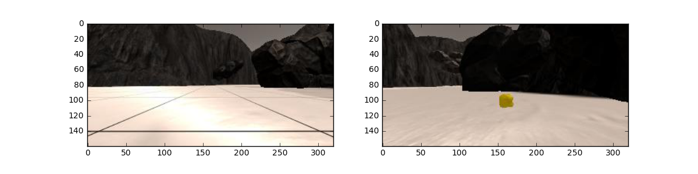
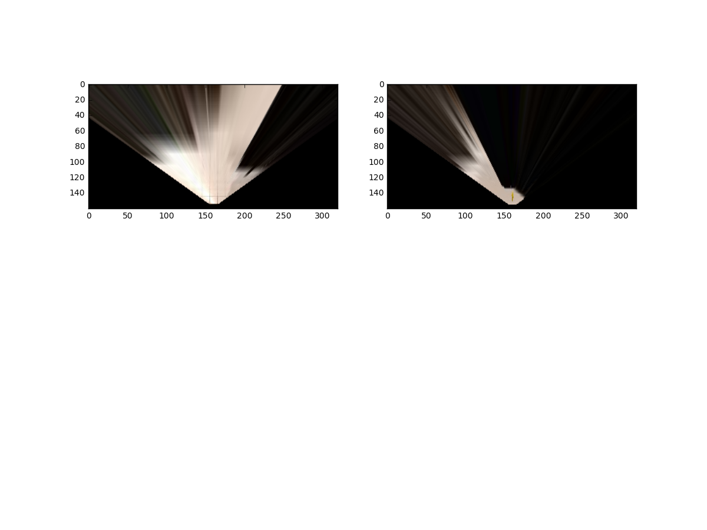
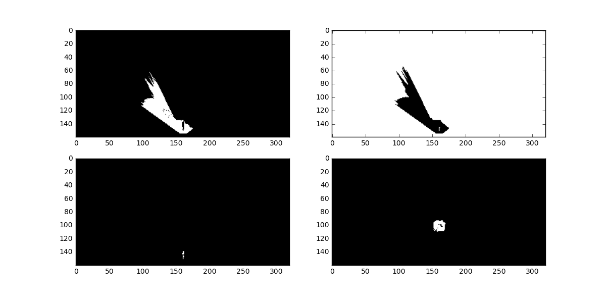
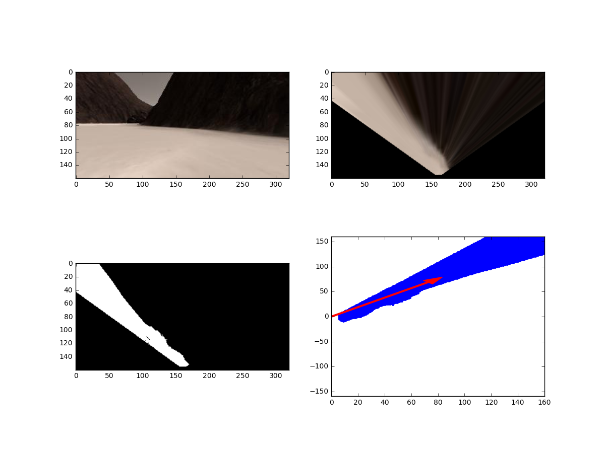
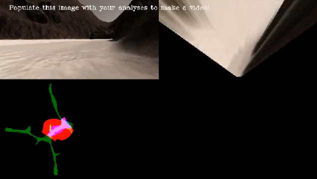

# **Search and Sample Return** 

My solution for the Robotics NanoDegree [Project #1](https://github.com/ladrians/RoboND-Rover-Project-P1).

## Introduction

The “Search and Sample Return” introduces us to perception, decision-making, and actions in robotics, everything in a cool simulation environment.

## Notebook Analysis

### Getting started

The notebook provided a great resource to process the images and provide a blueprint of a possible solution for the project (to be applied later). For detailed information check [here](./code/Rover_Project_Test_Notebook.ipynb).

### Image Processing

I started analyzing a random image from the `test_dataset` folder with a grid sample in conjunction with a rock sample.



### Perspective Transform

Using a four fixed points from the grid reference, the perspective transform is detailed as follows; the source and destination points are defined to warp the image to a grid where each 10x10 pixel square represents 1 square meter.



This function transforms the image viewed by the rover into a bird's eye view.

### Color Thresholding

We need to breakdown the image and identify the navigable terrain, obstacles, and the target stones. Afterwards, the rover transforms that image into a bird view perspective, which, as the robot keeps moving and obtaining imagery, maps the world surrounding it. Then the robot can decide what to do based on it's perception. What the notebook does is that it provides a walkthrough through each aspect necessary to accomplish the mapping process.

Based on the `color_thresh` function provided in the lectures I could identify ground pixels terrain and invert it, all applied to the warped image. The funcion was modified to identify navigable terrain and obstacles (depending on the parameters passed).

Then, I discarded the `find_rocks` function (commented in the walkthrough session) to detect rocks and changed it to `yellow_thresh` using the HSV color space from RGB to find the yellow rocks.

Both functions outputs a binary image which, the detail is:



In that manner, I detected the navigable terrain, the obstacles and the positions of rock samples.

### Coordinate Transformations

This section maps the rover relative position onto a common map. I used the standard functions provided:

* `rover_coords`: converts from image coords to rover coords.
* `to_polar_coords`: converts the rovers map coordinates into polar coordinates.
* `rotate_pix`: maps rover space pixels to world space.
* `translate_pix`: applies a scaling and a translation 
* `pix_to_world`: combines the previous functions. 

Below is detailed a sample; the top left image is the rover perception; top right the bird's eye view. Bottom left image identifies the navigable terrain and the bottom right the coordinate transformation; notice the red arrow represents the mean of all the binary true pixels in the image.



The correct usage of these functions details how far things are relative to the rover as well as the bearing.

### Process Image

The `process_image` function represents the perception steps needed to perform image analysis and mapping. All previous functions are combined and mapped to an existing map (called "ground truth" map of the world, where white pixels represent navigable terrain).

* `perspect_transfrom` is executed.
* `color thresholding` is executed to identify navigable terrain/obstacles/rock samples using `color_thresh` and `yellow_thresh` functions.
* Convert thresholded image pixel values to rover-centric coords using `rover_coords` function.
* Convert rover-centric pixel values to world coords using `pix_to_world` function. 
* Udate the worldmap.
* Compose a mosaic image from previous processing.



The process is repeated for all the images recorded and then stored as a video using the `moviepy` functions. The result can be checked [here](./output/test_mapping2.mp4).

## Autonomous Navigation and Mapping

### Perception step

The `perception_step` function within the `perception.py` file shares all the same functions as the jupyter notebook plus some modifications. The differences starts on step 7); where I added logic to improve rover fidelity.

```if is_valid_position(Rover.pitch, Rover.roll):
	Rover.worldmap[obstacle_y_world, obstacle_x_world, 0] += 1
	Rover.worldmap[rock_y_world, rock_x_world, 1] += 1
	Rover.worldmap[navigable_y_world, navigable_x_world, 2] += 1```

The `is_valid_position` function is in charge of evaluating the accuracy of the image where the truth map can only be updated if the roll and pitch angles are near zero. This way, the fidelity goes from 40% to 80%.

```def is_valid_position(pitch, roll):
    # Your perspective transform is technically only valid when roll and pitch angles are near zero
    return ((pitch > angle_lower_bound or pitch < angle_upper_bound) and (roll > angle_lower_bound or roll < angle_upper_bound))```

Another modification is to detect rocks and move towards it (when possible) to pick them up. I added a `is_rock_ahead` function within step 8):

```def is_rock_ahead(rock_thresh):
    return rock_thresh.any()```

The rover behavior is changed if a rock is detected:	

```if is_rock_ahead(rock_thresh):
	dist, angles = to_polar_coords(xpix_rock, ypix_rock)
	Rover.sample_detected = True
	Rover.rock_spot_count = 0 # The rover will reset the rock spot counter
	rock_idx = np.argmin(dist)
	rock_xcen = rock_x_world[rock_idx]
	rock_ycen = rock_y_world[rock_idx]
	Rover.worldmap[rock_ycen, rock_xcen, 1] += 1
	Rover.vision_image[:, :, 1] = rock_thresh * 255
else:
	dist, angles = to_polar_coords(xpix_terrain, ypix_terrain)```

The new variable `sample_detected` will mark the new state (to be processed within `decision.py`) and the rock location is tracked.

### Decision step

From the original code I added two new states `sample_detected` and `stuck`. The first one to change behavior when a rock is detected and the second one to try to unstuck the rover in certain conditions.

#### Mark Home

At the beginnig of the process the Home position is set.

```if Rover.at_home: # Record Home
	Rover.start_position = Rover.pos
	Rover.at_home = False```

#### Rock picking

The perception step will enable the `Rover.sample_detected` variable when a rock is detected and its location is tracked. The rover will go directly to it and when it is within range (`Rover.near_sample` variable) the gripper is used.

```if Rover.sample_detected: # Try collecting a rock
	if Rover.near_sample:
		Rover.brake = Rover.brake_set
		Rover.throttle = 0
		Rover.steer = 0
	else:
		#print("detection Rover.vel", Rover.vel)
		if 0 < Rover.vel < Rover.max_vel - 1.0:
			# Set throttle value to throttle setting
			Rover.throttle = Rover.throttle_set
		elif Rover.vel <= 0:
			if Rover.throttle == 0:
				Rover.throttle = 2.0
				Rover.steer = get_biased_steer_angle(Rover.nav_angles, -10, 10, 8)
			else:
				Rover.throttle = 0
				Rover.steer = -15
				Rover.mode = 'stop'
		else:  # try to decelerate
			Rover.throttle = -0.1
		Rover.brake = 0
		Rover.steer = get_steer_angle(Rover.nav_angles, -5, 15) # Bias to the right
	Rover.sample_detected = False```

Once it finished, it resumes to exploration (`forward` mode).

```# If in a state where want to pickup a rock send pickup command
if Rover.near_sample and Rover.vel == 0 and not Rover.picking_up:
	Rover.send_pickup = True
	Rover.sample_detected = False
	Rover.mode = 'forward'```

Notice that the exploration has a explicitly bias set to the right.

```# Added a bias to the default steering angle
def get_biased_steer_angle(nav_angles, min, max, bias):
    return get_steer_angle(nav_angles, min, max)+bias

# Get steering angle within expected max and min values
def get_steer_angle(nav_angles, min, max):
    try:
        return np.clip(np.mean(nav_angles * 180 / np.pi), min, max)
    except:
        return 0.```

#### Unstuck Rover

Another new state was added to try to `unstuck` the rover in certain conditions. Basically if the rover is in `forward` mode and not moving the new state is set.

```if abs(Rover.vel) < 0.05:
	# Wait a little
	Rover.vel_count += 1
	if Rover.vel_count > 400:
		Rover.vel_count = 0
		Rover.stuck_count = 0
		Rover.throttle = 0
		Rover.brake = 0
		Rover.steer = 0
		Rover.mode = 'stuck' # change mode```

For a few frames the rover will go in reverse mode and then continue in `forward` mode.

```elif Rover.mode == 'stuck':
	#print("stuck Rover.vel", Rover.vel)
	Rover.stuck_count += 1 # accumulate the count
	Rover.steer = 0
	Rover.throttle = -0.1 # slowly reverse mode
	Rover.brake = 0	
	if Rover.stuck_count > 300: # end of the stuck mode
		# Reset counters and change mode
		Rover.stuck_count = 0
		Rover.steer = 0
		Rover.mode = 'forward'```

### Drive Rover

A minor modification was set on the `RoverState` class to change the thresholds for stopping and moving forward, it makes the difference when targeting the rock samples.

```self.stop_forward = 75 # Threshold to initiate stopping
self.go_forward = 600 # Threshold to go forward again```

I added some extra parameters to keep track of the new states, transitions and Home position.

```# Extra parameters added
self.sample_detected = False # To flag a rock detection
self.start_position = None # Home position
self.at_home = True # To flag the Home position
self.vel_count = 0 # Start the velocity count at zero```

### Execution

Change directory to the `code` folder and run the following from the command line: 

```sh
python drive_rover.py
```

Then launch the simulator and choose "Autonomous Mode". The rover by default will drive in autonomous mode exploring the environment. Every time a rock is detected it will try to pick it and resume the exploration mode.

The resolution used for the simulation is:

* Screen: 640 x 480 (windowed)
* Graphics Quality: Fastest
* Frames per second: 30 to 33 FPS.

The best result I could get can be checked [here](./output/P1_samplevideo.mp4)

### Improvements

The `Go Home` routine was not implemented, I just tracked the home location for further processing later. I could never pick all the stones.

The navigation has a bias to the right to try to navigate all the map, it would be great to use a better euristic for that.

Based on the slack #udacity_search_map channel, narrowing the field of view will get a better fidelity.

In some cases the routine to pick a rock does not work, specially for those cases where the rock is in a difficult possition. The `move to stone` function should be modified to take into accout its surroundings and better plan how to approach it.

### Resources

* [Project Walkthrough](https://www.youtube.com/watch?v=oJA6QHDPdQw)
* [Project Baseline](https://github.com/ladrians/RoboND-Rover-Project-P1)
